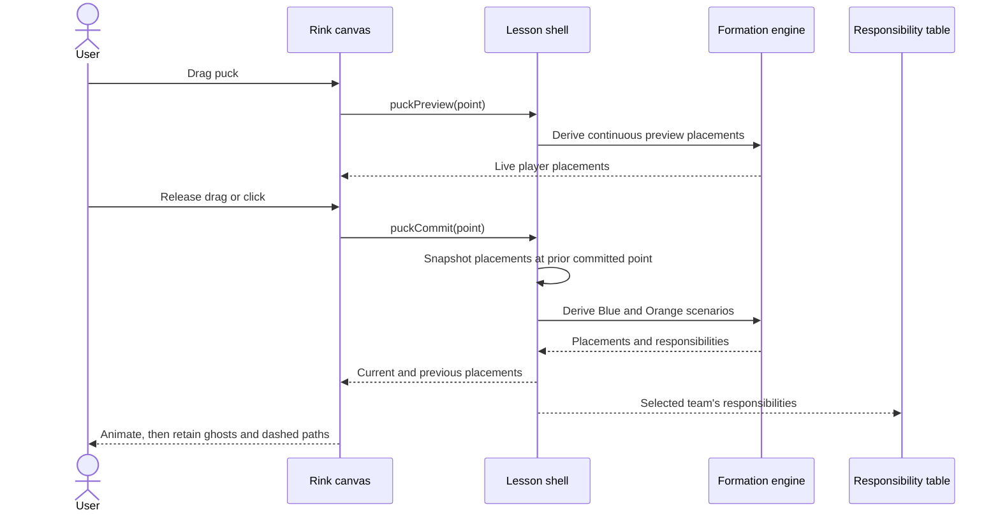

# INT-001 — Commit a puck scenario

During dragging, the puck and all derived placements respond continuously without replacing the saved trail origin. Release commits the exact point and compares it with the prior committed formation, including moves inside one teaching area. Possession changes use the same snapshot and derivation flow.

## INT-002 — Draw and clear markup

When markup mode is enabled, pointer down starts an ephemeral stroke, sufficiently separated move samples append points, and the renderer connects them with midpoint quadratic curves. Pointer release completes the stroke. The semi-transparent marker layer is drawn above rink/trail graphics but beneath players and the puck. Clear markup increments a shell-owned clear version, resets every stroke, and disables the clear control.
