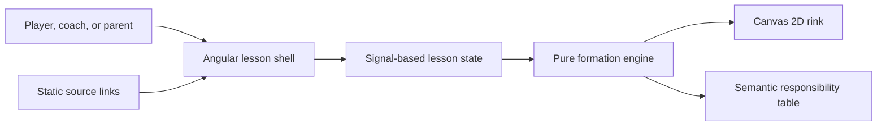

# Architecture Overview

The system is one deployable browser application with no trust boundary or server-side data.

The diagram shows how one exact puck state produces both continuous visual placements and categorical written responsibilities. Canvas drawing owns no tactics. The formation engine owns no DOM or animation behavior.

## Key boundaries

- Angular shell: possession, team selection, accessibility announcements, and scenario history.
- Formation engine: classification, team-relative transformation, lane interpolation, role-specific micro-movement, and responsibility content.
- Rink canvas: drawing, pointer preview, commit events, keyboard navigation, resize, and animation.
- Static host: serves generated files; there is no API, storage, authentication, telemetry, or secret.

See [ADR-0002](../decisions/0002-add-continuous-micro-movements.md).
